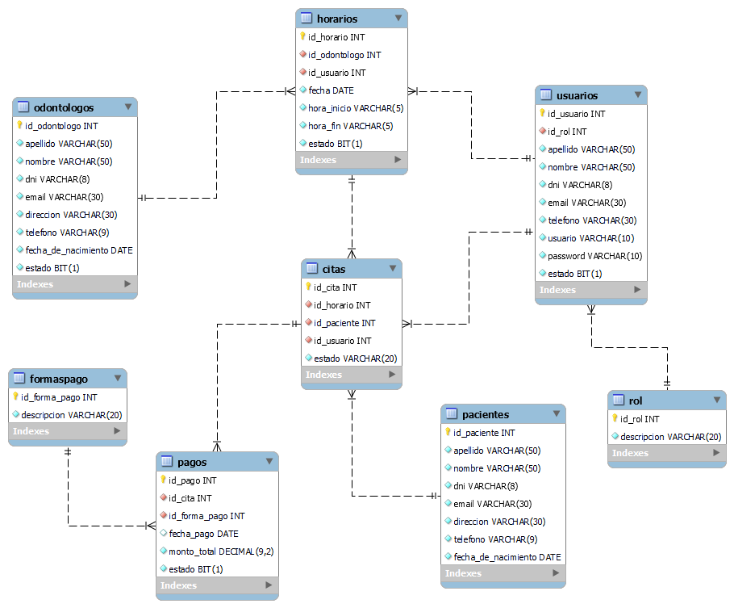

# MolarDentalCare API REST

Este es el backend de la APP WEB MolarDentalCare para la gestión de citas odontologicas, aplicando el patrón de arquitectura de N-Capas. Está realizado en el lenguaje `java 17` usando su framework `Spring Boot v3.2.0` con la base de datos relación de MySQL.

Diagrama de Entidad Relación (ER):



## ¿Cómo descargar el proyecto?

Primero descargamos este proyecto como `.zip` o clonarlo haciendo uso de un comando de `git`, de la siguiente manera:

```
git clone https://github.com/MrDevv/MolarDentalCareAPI-SpringBoot.git
```

Abrimos el proyecto en `IntelliJ IDEA` o algún otro IDE.

## Creación de  la base de Datos

Dentro del proyecto encontraremos un archivo sql `script database.sql` que contiene los comandos para crear la base de datos con sus tablas.

O también puedes copiarlos directamente de aquí:

```
CREATE DATABASE db_molar_dental_care;

USE db_molar_dental_care;

CREATE TABLE odontologos(
        id_odontologo INT NOT NULL AUTO_INCREMENT,
	apellido VARCHAR(50) NOT NULL,
	nombre VARCHAR(50) NOT NULL,
	dni VARCHAR(8) NOT NULL,
	email VARCHAR(30) NOT NULL,
	direccion VARCHAR(30) NOT NULL,
	telefono VARCHAR(9) NOT NULL,
	fecha_de_nacimiento DATE NOT NULL,
	estado BIT(1) NOT NULL,
	PRIMARY KEY (id_odontologo)
);

CREATE TABLE rol(
	id_rol INT NOT NULL AUTO_INCREMENT,
        descripcion VARCHAR(20) NOT NULL,
	PRIMARY KEY (id_rol)
);

CREATE TABLE usuarios (
	id_usuario INT NOT NULL AUTO_INCREMENT,
	id_rol INT NOT NULL,
	apellido VARCHAR(50) NOT NULL,
	nombre VARCHAR(50) NOT NULL,
	dni VARCHAR(8) NOT NULL,
	email VARCHAR(30) NOT NULL,
	telefono VARCHAR(30) NOT NULL,
	usuario VARCHAR(10) NOT NULL,
	password VARCHAR(10) NOT NULL,
	estado BIT(1) NOT NULL,
	PRIMARY KEY (id_usuario),
	FOREIGN KEY (id_rol) REFERENCES rol (id_rol) ON DELETE CASCADE
);

CREATE TABLE horarios (
	id_horario INT NOT NULL AUTO_INCREMENT,
	id_odontologo INT NOT NULL,
	id_usuario INT NOT NULL,
	fecha DATE NOT NULL,
	hora_inicio VARCHAR(5) NOT NULL,
	hora_fin VARCHAR(5) NOT NULL,
	estado BIT(1) NOT NULL,
	PRIMARY KEY (id_horario),
	FOREIGN KEY (id_odontologo) REFERENCES odontologos(id_odontologo) ON DELETE CASCADE,
	FOREIGN KEY (id_usuario) REFERENCES usuarios(id_usuario) ON DELETE CASCADE
);

CREATE TABLE pacientes (
	id_paciente INT NOT NULL AUTO_INCREMENT,
	apellido VARCHAR(50) NOT NULL,
	nombre VARCHAR(50) NOT NULL,
	dni VARCHAR(8) NOT NULL,
	email VARCHAR(30) NOT NULL,
	direccion VARCHAR(30) NOT NULL,
	telefono VARCHAR(9) NOT NULL,
	fecha_de_nacimiento DATE NOT NULL,
	PRIMARY KEY (id_paciente)
);

CREATE TABLE citas (
	id_cita INT NOT NULL AUTO_INCREMENT,
	id_horario INT NOT NULL,
	id_paciente INT NOT NULL,
	id_usuario INT NOT NULL,
	estado VARCHAR(20) NOT NULL,
	PRIMARY KEY (id_cita),
	FOREIGN KEY (id_horario) REFERENCES horarios(id_horario) ON DELETE CASCADE,
	FOREIGN KEY (id_usuario) REFERENCES usuarios(id_usuario) ON DELETE CASCADE,
	FOREIGN KEY (id_paciente) REFERENCES pacientes(id_paciente) ON DELETE CASCADE
  );
  
CREATE TABLE formaspago(
	id_forma_pago INT NOT NULL AUTO_INCREMENT,
        descripcion VARCHAR(20) NOT NULL,
	PRIMARY KEY (id_forma_pago)
);
  
CREATE TABLE pagos(
	id_pago INT NOT NULL AUTO_INCREMENT,
	id_cita INT NOT NULL,
	id_forma_pago INT NOT NULL,
        fecha_pago DATE,
	monto_total DECIMAL(9,2) NOT NULL,
	estado BIT(1) NOT NULL,
	PRIMARY KEY (id_pago),
	FOREIGN KEY (id_cita) REFERENCES citas(id_cita) ON DELETE CASCADE,
	FOREIGN KEY (id_forma_pago) REFERENCES formaspago(id_forma_pago) ON DELETE CASCADE
);
```
## Registro de datos importantes

Una vez creada la base de datos tenemos que registrar los **roles** y un **usuario** con el rol de Administrador, también los metodos de pago.

#### Creamos los roles
```
INSERT INTO rol(descripcion) VALUES('Administrador'), ('Asistente');
```
#### Creamos el usuario con el rol de Administrador

```
INSERT INTO usuarios(id_rol, apellido, nombre, dni, email, telefono, usuario, password, estado) 
VALUES(1, 'Vasquez', 'Leon', '78490394', 'admin@gmail.com', '999333999','admin', 'admin', 1)
```

#### Creamos los metodos de pago

```
INSERT INTO formaspago(descripcion) VALUES('Efectivo'), ('Tarjeta');
```
## Configuración de la base de datos

Ahora tenemos que configurar el archivo `application.properties` que se encuentra dentro del proyecto en la carpeta de **resources**.

Encontraremos el siguiente contenido:

```
#config database
spring.datasource.url=jdbc:mysql://localhost:3306/db_molar_dental_care
spring.datasource.username=root
spring.datasource.password=admin
spring.datasource.driver-class-name=com.mysql.cj.jdbc.Driver
```

El url de la base de datos es predeterminado, si ha cambiado la configuración al momento de instalar el gestor, considerar su configuración.

Para el **username** y el **password** debe colocar sus credenciales que configuró al momento de instalar el gestor de base de datos.


